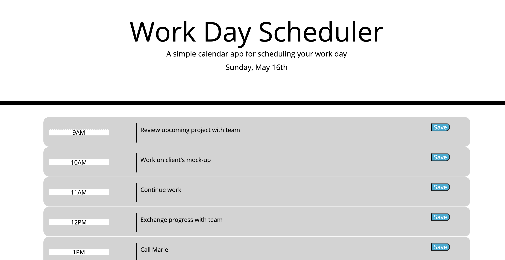
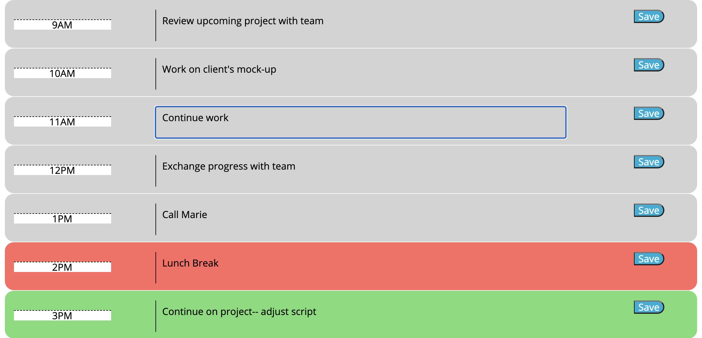
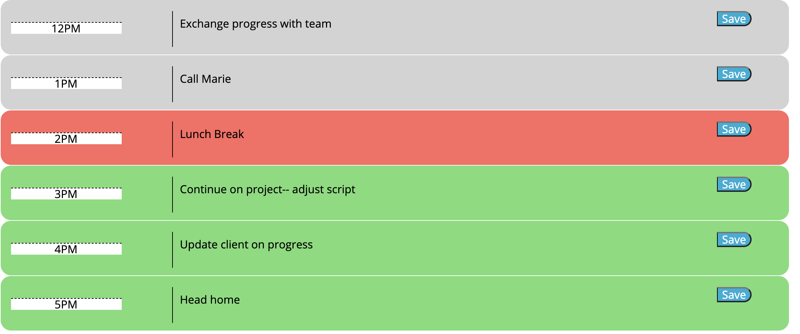

# plannie

## Description

Plannie, is a daily planner that helps the user better organize their time and manage tasks effortlessly. Plannie will become a daily utility for the average consumer who has too many tasks with no guidance on how to organize their day efficiently. 

Go on and check out :date: :white_check_mark: [Plannie: Simple Scheduler](https://disantoz.github.io/plannie/)! 

## Usage

When the user loads Plannie, they are presented with the current date on top and a list of time slots for their work week: 9am-5pm:

Each individual time block allows the user to enter a task and then save the task to the planner. Don't worry about exiting the browser, the task will be saved to the planner!

The planner dynamically changes as the day progress. Any time in the past will display a grey color on the time slot, current time slots will be red and tasks in the future will be green.

Please feel free to use this planner in order to better help organize your day! As always, reach out to me if you'd like to see some modifications or updates in the future!

## License

MIT License

Copyright (c) [2021] [DiSantoz]

Permission is hereby granted, free of charge, to any person obtaining a copy
of this software and associated documentation files (the "Software"), to deal
in the Software without restriction, including without limitation the rights
to use, copy, modify, merge, publish, distribute, sublicense, and/or sell
copies of the Software, and to permit persons to whom the Software is
furnished to do so, subject to the following conditions:

The above copyright notice and this permission notice shall be included in all
copies or substantial portions of the Software.

THE SOFTWARE IS PROVIDED "AS IS", WITHOUT WARRANTY OF ANY KIND, EXPRESS OR
IMPLIED, INCLUDING BUT NOT LIMITED TO THE WARRANTIES OF MERCHANTABILITY,
FITNESS FOR A PARTICULAR PURPOSE AND NONINFRINGEMENT. IN NO EVENT SHALL THE
AUTHORS OR COPYRIGHT HOLDERS BE LIABLE FOR ANY CLAIM, DAMAGES OR OTHER
LIABILITY, WHETHER IN AN ACTION OF CONTRACT, TORT OR OTHERWISE, ARISING FROM,
OUT OF OR IN CONNECTION WITH THE SOFTWARE OR THE USE OR OTHER DEALINGS IN THE
SOFTWARE.
